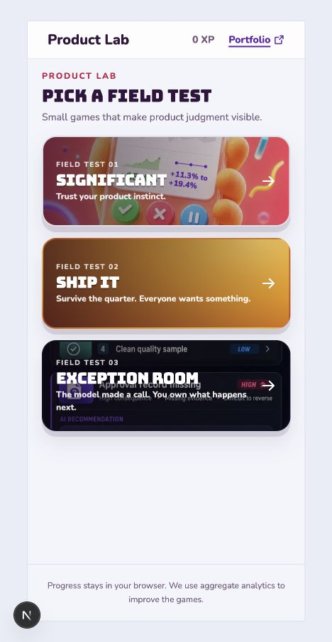
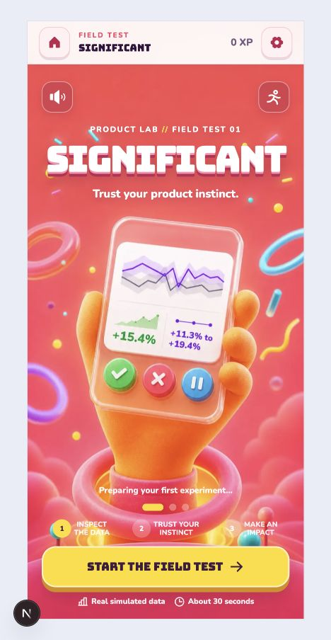
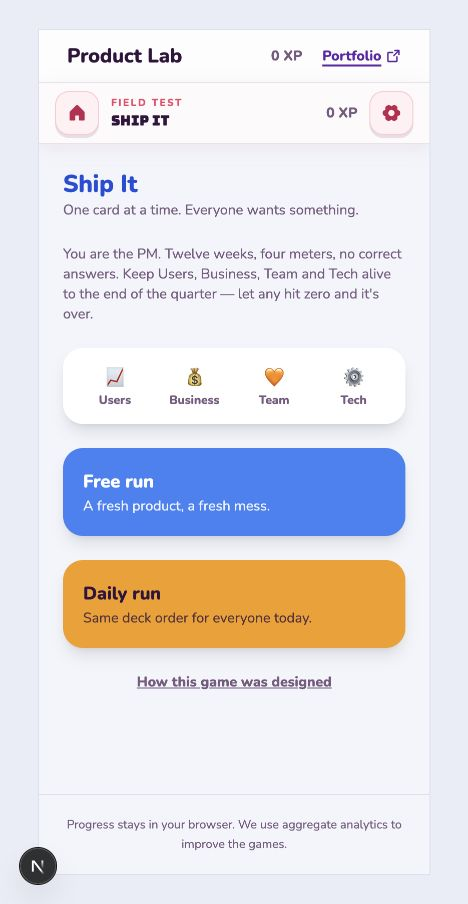
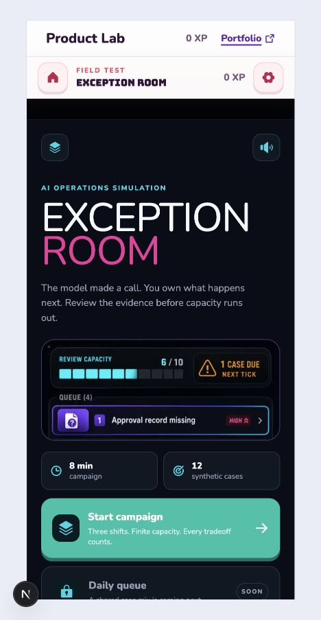
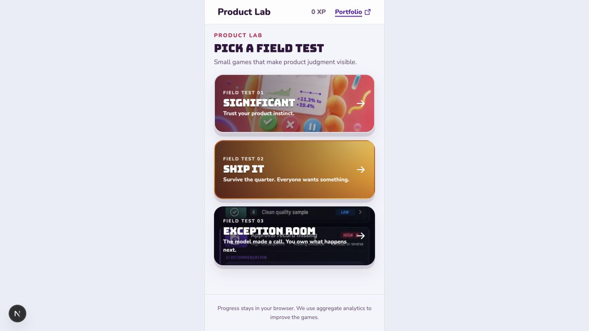
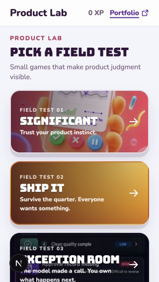

# Game Hub and App Architecture Audit

**Date:** 2026-07-17
**Repository:** `poseyedawn/pm-lab`
**Audited revision:** `4b6f3f4` on `main`
**Audit mode:** Combined UX, accessibility risk, responsive, repository, and architecture audit
**Primary viewport:** 390 by 844
**Narrow viewport:** 320 by 568
**Desktop check:** 1280 by 720 with the mobile canvas centered
**Research baseline:** [Mobile Game Hub Engagement Research](../research/2026-07-17-mobile-game-hub-research.md)

## Overall verdict

**Approve a bounded architecture cleanup before redesign.**

The Fable build succeeds at the foundational job: one home route now exposes Significant, Ship It, and Exception Room as full-card links inside the shared Product Lab shell. The hub is understandable and mobile-sized. It is not yet visually cohesive enough to serve as the final game library, and its source structure duplicates game identity across several files.

The recommended sequence is:

1. Preserve current behavior and visuals.
2. Centralize the game catalog and shell policy.
3. Move Significant-specific entry code out of the shared `lab` namespace.
4. Run the full test and rendered-browser gates.
5. Begin the visual redesign only after that foundation is stable.

## Flow evidence

### Step 1: Product Lab hub at 390 by 844

**Health:** Needs revision

Strengths:

- All three games are presented as large, full-card links.
- The hierarchy is simple and the page fits the intended mobile canvas.
- The game name and one-line promise are available as real text.
- Decorative card art uses empty alternative text, which avoids duplicate announcements.

Risks:

- The three card worlds are inconsistent. Significant uses purpose-built art, Ship It uses a gradient, and Exception Room uses a screenshot with embedded interface text.
- The hub has no returning-player priority even though the profile system already stores per-game progress and last-played timestamps.
- `0 XP` competes with the primary navigation before it has any value to a first-time player.
- The headline says `field test`, while the user goal is to discover and choose a game. The collection language should be tested during redesign.

### Step 2: Significant entry

**Health:** Healthy as a standalone entry, visually dominant relative to the other games

Strengths:

- Strong, recognizable campaign art.
- Clear primary action and useful time expectation.
- Large controls and clear visual press affordances.

Risks:

- Its visual finish sets an expectation that Ship It does not currently meet.
- Its immersive shell hides the global Lab header and footer through game-specific global selectors, while the other two games keep both header layers.

### Step 3: Ship It entry

**Health:** Functional, needs visual redesign

Strengths:

- Free and daily modes are clearly separated.
- The core four-meter premise is explained before launch.
- The routes are reachable and semantically exposed as links.

Risks:

- The surface reads as a generic application page rather than a game world.
- Emoji are used as visible meter artwork, which is inconsistent across platforms and does not match the supplied visual direction.
- The two stacked global headers use valuable vertical space without adding a new decision.

### Step 4: Exception Room entry

**Health:** Healthy as a standalone entry, hub artwork needs revision

Strengths:

- Strong identity, clear primary campaign action, and truthful synthetic-case disclosure.
- Campaign duration and case volume set useful expectations.
- The visual system feels deliberate and distinct from the shared shell.

Risks:

- The hub reuses this interface screenshot as card art. Its embedded text competes with the hub title overlay.
- The global Lab header and game header are both visible, creating a denser entry than Significant.

### Step 5: Desktop framing

**Health:** Healthy and intentional

The 390-pixel Product Lab canvas remains centered on desktop without horizontal overflow. This preserves the mobile-first product decision and should remain the default unless a later redesign explicitly changes it.

### Step 6: Narrow mobile reflow at 320 by 568

**Health:** Needs revision

Strengths:

- The document does not overflow horizontally.
- All card targets remain 280 pixels wide and 128 pixels tall.

Risks:

- The Exception Room screenshot contains embedded labels that collide visually with the overlaid card title and tagline.
- Long titles and promises have too little protected space from the arrow at the narrow size.
- The hub needs an explicit title-safe area in the future capsule-art contract.

## Accessibility evidence

Confirmed from the rendered flow and source:

- The hub is a labelled navigation region.
- Each game is one full-card link, well above the 44 by 44 point primary target baseline.
- A skip link exists before the shared header.
- The hub has no horizontal overflow at 320 or 390 pixels.
- Decorative card images use empty alternative text while the game identity remains visible as text.
- Global source styles define a 4-pixel `focus-visible` outline and reduced-motion handling.

Risks and gaps:

- Card taglines render at 12 pixels. They are readable in the captured state but fall below Apple's preferred handheld body size.
- Text contrast over image content depends on the scrim and needs measurement against final capsule art.
- Keyboard focus could not be exercised through the selected browser capture surface, so the declared focus style is source-confirmed but not interaction-confirmed.
- Screen-reader order, zoom reflow, switch control, and real-device touch behavior remain unverified.
- The visible Next.js development control in the screenshots is local tooling, not product UI.

## Repository and branch audit

Branch consolidation is healthy:

- GitHub default branch is `main`.
- The local checkout and remote each expose only `main` after pruning.
- Product Lab PR 4 is merged into `main`.
- No stale integration worktrees remain attached to this repository.

Baseline verification on the audited revision:

- 43 test files passed.
- 237 tests passed.
- Lint completed with 0 errors and 4 existing warnings.
- Production build completed successfully across all 13 product routes.

## App directory and architecture findings

### A1. Game identity is duplicated across three sources

`LabHub.tsx` owns names, taglines, routes, field-test numbers, and art. `GameHeader.tsx` owns another name map. `gameThemes.ts` owns a separate theme map. Adding or renaming a game requires synchronized edits and creates drift risk.

**Required restructure:** Create one typed game catalog and have the hub, headers, and shells read from it.

### A2. The shared `LabLanding` name now describes a Significant-only screen

After the new hub became the real Lab landing page, `LabLanding`, `useLabLanding`, and `labLanding.ts` remain Significant-specific. Their names and folders imply shared ownership while their logic reads only Significant progress and routes.

**Required restructure:** Move and rename this stack under the Significant component, hook, and library pods.

### A3. Shared chrome behavior is coupled to Significant through global CSS selectors

The root shell uses `:has([data-game="significant"])` to hide the Lab header and footer. This makes a game ID responsible for layout policy and makes future immersive games harder to add.

**Required restructure:** Store a typed shell mode in the game catalog and emit a generic data attribute for the root shell selectors.

### A4. Significant styling is loaded globally

`globals.css` imports `significant.css`, while Exception Room imports its stylesheet from its route layout. The current approach loads one game's full visual system for every route.

**Required restructure:** Scope the Significant stylesheet to its route layout after verifying Next.js 16 CSS ordering requirements.

### A5. Route metadata is inconsistent

The root and Exception Room have route metadata, while Significant and Ship It rely on inherited defaults.

**Follow-up:** Use the shared catalog as the source for per-game title and description metadata. This can be done after the structural cleanup if it expands the change surface.

### A6. Visual artwork is not yet a shared contract

Ship It has no hub art and Exception Room uses a raw interface screenshot. The hub component accepts any path without an explicit crop or focal-position contract.

**Redesign-stage follow-up:** Define a shared capsule aspect ratio, title-safe zone, focal position, and dedicated asset for every game. Do not solve this with more CSS around the current images.

## Restructure boundary

The architecture pass may:

- Centralize typed game metadata and shell policy.
- Rename and relocate Significant-specific landing code.
- Replace game-specific shell selectors with generic policy selectors.
- Scope Significant CSS to its route.
- Add tests for catalog completeness and consumer behavior.

The architecture pass must not:

- Change the current hub composition, copy, color, art, or motion.
- Redesign Ship It or Exception Room.
- Add search, filters, social systems, currencies, or new game modes.
- Push, merge, deploy, or alter production without separate owner approval.

## Restructure disposition

The bounded cleanup was completed on `codex/game-hub-research-audit` without changing the hub composition, copy, artwork, color, or motion.

Resolved:

- **A1:** `src/lib/gameCatalog.ts` is now the typed source for game identity, route, theme, order, artwork, and shell mode. The hub, header, and shell consume it.
- **A2:** Significant entry components, hook, and landing helpers now live under Significant-specific folders and names.
- **A3:** The root shell now responds to `data-lab-chrome="immersive"` instead of a hard-coded Significant game ID.
- **A4:** Significant's visual stylesheet is imported by its route layout. Shared game-header and settings styles remain global because Ship It and Exception Room use them too.

Deferred to the redesign stage:

- **A5:** Route metadata still needs a consistent catalog-backed implementation.
- **A6:** Dedicated capsule artwork, focal positions, and title-safe areas remain a visual-design decision.

Post-cleanup verification is recorded in [Game Hub Structure Verification](../qa/2026-07-17-game-hub-structure-verification.md).
