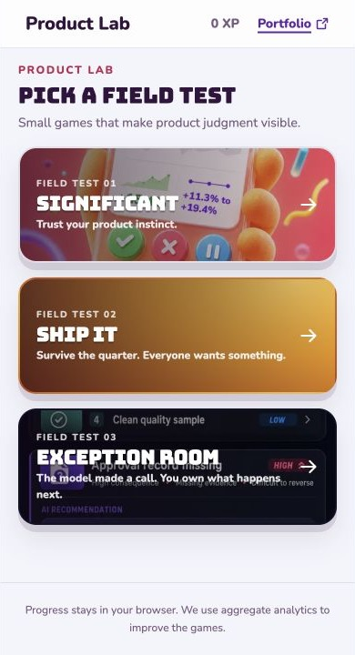
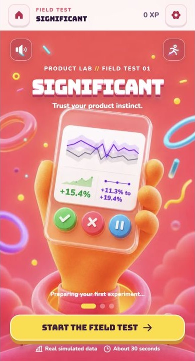
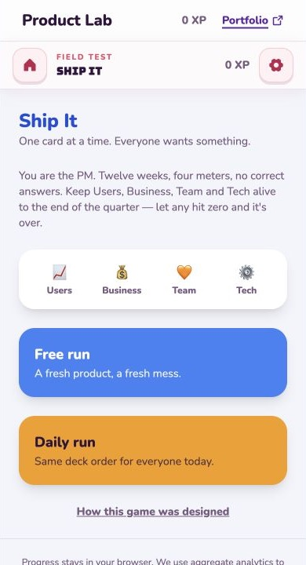
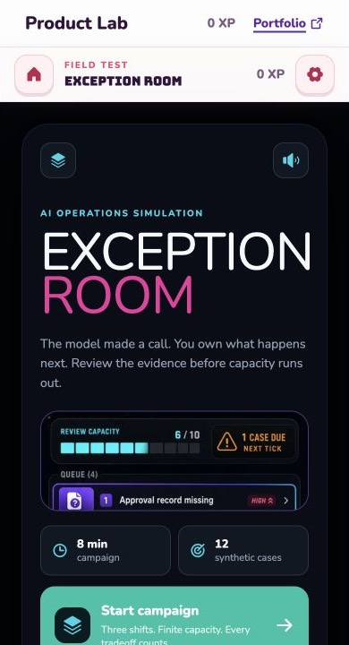

# Game Hub Structure Verification

**Date:** 2026-07-17
**Branch:** `codex/game-hub-research-audit`
**Scope:** Verify that the architecture cleanup preserves the existing Product Lab hub and all three game entry routes.
**Primary rendered check:** Centered 390-pixel game canvas at a 1280 by 720 browser viewport

## Outcome

**Pass.** The cleanup centralizes game metadata and shell policy without changing the visible hub or game-entry composition.

## Rendered flow

### Step 1: Product Lab hub

**Health:** Pass

- The hub renders exactly three full-card game links in the original order.
- Significant, Ship It, and Exception Room retain their original names, promises, artwork, and routes.
- The narrow 390-pixel canvas remains centered on desktop.

### Step 2: Significant

**Health:** Pass

- The route emits `data-lab-chrome="immersive"`.
- The global Product Lab header and footer are hidden through the generic shell policy.
- The shared game header retains its sticky position, background, controls, and 44-pixel targets.
- Significant's route-scoped stylesheet loads successfully after the file move.

### Step 3: Ship It

**Health:** Pass

- The route emits `data-lab-chrome="standard"`.
- The Product Lab header and game header both remain visible.
- Existing layout, modes, copy, and controls remain unchanged.

### Step 4: Exception Room

**Health:** Pass

- The route emits `data-lab-chrome="standard"`.
- The Product Lab header and game header both remain visible.
- Existing campaign composition, copy, and controls remain unchanged.

## Responsive evidence

The pre-cleanup audit confirmed no horizontal overflow at 390 by 844 or 320 by 568. The cleanup does not alter card or frame styles, and the post-cleanup desktop render still constrains the product to its 390-pixel canvas. A second 320-pixel capture was not available from the selected browser surface, so the narrow post-cleanup state is source-confirmed rather than recaptured.

## Automated checks

- 45 test files passed.
- 241 tests passed.
- Lint completed with 0 errors and the same 4 pre-existing warnings.
- Production build completed successfully across all 13 product routes.
- Focus styling and reduced-motion behavior remain source-confirmed.

## Before and after assessment

The accepted baseline screenshots and the post-cleanup screenshots show the same hierarchy, art, copy, controls, and shell behavior. Differences are limited to viewport height and local Next.js development tooling. No redesign was introduced in this pass.
